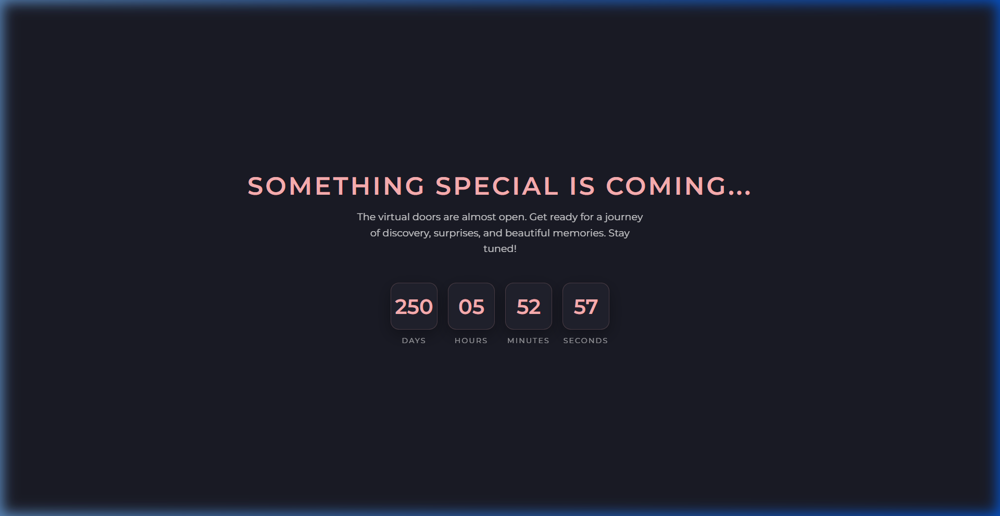

# 3Droom - Premium Giftbox Experience 🎁✨

Welcome to the **Premium 3D Giftbox Experience**, an immersive web application designed to take users on a magical journey of discovery and celebration. Built with React, Three.js, and Framer Motion, this project blends high-end 3D environments with emotional storytelling.

---

## 🌟 What is this Project?
This is a personalized, interactive 3D unboxing journey. Instead of a simple webpage, users enter a detailed **3D Virtual Room** where they explore, find hidden secrets, and unlock a sequence of 11 unique gifts. It’s designed as a premium birthday or anniversary surprise experience.

---

## 🚀 The User Experience Journey

### 1. The Landing (The Hook)
Users are greeted with a mysterious, floating 3D Giftbox. A soft countdown and premium overlay set the stage, inviting the user to "Open the Box" to reveal the world inside.

### 2. Room Exploration (The Discovery)
Once inside, the user is placed in a beautifully lit **3D Room**. 
- **Interactivity**: Users can scroll down to explore the room.
- **Hidden Characters**: Interact with characters like the **Panda, Bunny, and Happysad** toy, each sharing a unique story.
- **Zoom Features**: Smooth camera transitions allow users to zoom into the laptop screen or photo frames for a closer look.

### 3. The Sequential Unboxing (The Challenge)
Users must find **11 specific gifts** hidden within a 3D gallery. 
- **Order Matters**: Gifts must be unlocked sequentially (Gift 1, then Gift 2, etc.).
- **Click Precision**: Some boxes are tricky! Users might need to rotate the camera and try different angles to find the right spot to click.

### 4. Interactive Reveal & Capture Mode (The Memories)
When a gift is found:
- **3D Reveal**: The specific gift (e.g., Balloons, Phone, Jewelry) appears in a cinematic standalone 3D view.
- **Capture Mode**: Users are encouraged to use their **Webcam** to take a photo of yourself with the gift.

### 5. Square Memory Collage & Final Reveal (The Conclusion)
- **Square Collage**: All captured photos are automatically arranged into a sleek **Square Memory Grid**.
- **Final Reveal**: The journey ends with a premium "Thank You" screen featuring the `Thanks.jpg` image and a special "Visit Again" message.

### ⏳ Countdown Page Preview


*When the project is accessed before the launch date, users see this premium, dark-themed countdown timer.*

---

## 📱 Device Compatibility & Mobile Fallback
This experience is highly intensive and relies on high-end 3D rendering (WebGL) to provide a premium visual journey. 
- **Desktop Optimization**: The 3D room, complex lighting, and interactive unboxing are best experienced on a Desktop or Laptop.
- **Mobile Fallback**: To ensure a consistent experience, a graceful fallback screen is implemented for mobile devices, informing users that the experience is optimized for larger screens and encouraging them to switch devices for the full immersion.

---

## 🛠️ Technical Customization Guide

### 📸 How to Change Interactive Pictures
In the `RoomExperience.jsx` file, I have implemented placeholder addresses for the character popups. To use your own images:
1. Locate the `characterMessages` object in `src/components/RoomExperience.jsx`.
2. Find the `image` fields labeled as **`Temppic1`**, **`Temppic2`**, and **`Temppic3`**.
3. Replace these strings with your actual image paths (e.g., `/images/myphoto.jpg`).

### ⏳ How to Update the Countdown
To change the date when the experience opens:
1. Open `src/App.jsx`.
2. Look for the **`TARGET_DATE`** constant (e.g., `new Date('2026-04-12T12:00:00')`).
3. Update it to your desired date and time. The countdown will automatically adjust!

### 🎨 Custom 3D Models (Blender Optimized)
All 3D assets in this project (Room, Gifts, Boxes) were custom-designed in **Blender**.
- **Optimized for Web**: Models are exported as high-performance `.glb` files with compressed geometry to ensure fast loading times.
- **Custom Lighting**: All meshes are configured with custom materials and UV mapping to react realistically to the React-Three-Fiber lighting engine.
- **Dynamic Items**: The `11Newgifts.glb` contains distinct sub-meshes that are dynamically loaded to provide a unique reveal for every gift.

---

## 💻 How to Access & Run Locally

### Setup Steps
1. **Clone the Repository**:
   ```bash
   git clone https://github.com/Shalemraj593/3Droom.git
   ```
2. **Install Dependencies**:
   ```bash
   npm install
   ```
3. **Run Development Server**:
   ```bash
   npm run dev
   ```

---

**Created with ❤️ by Shalem**
